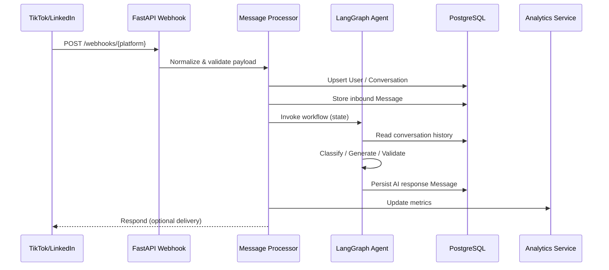
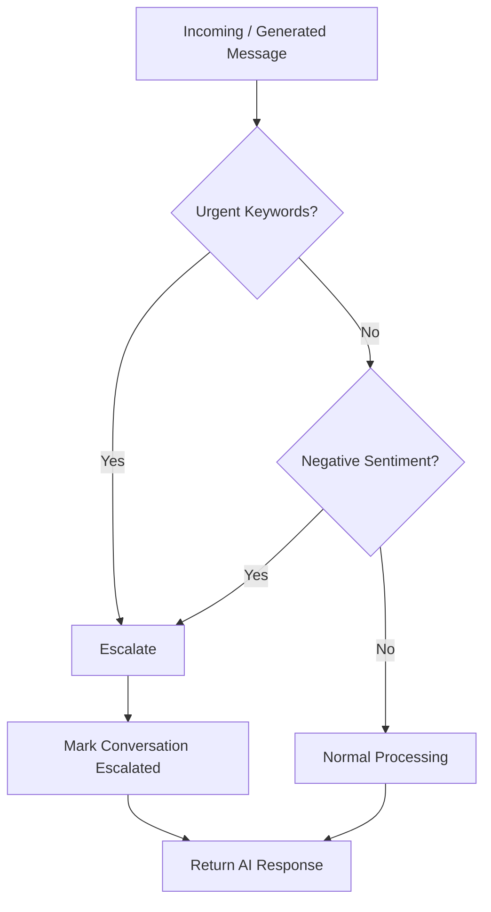
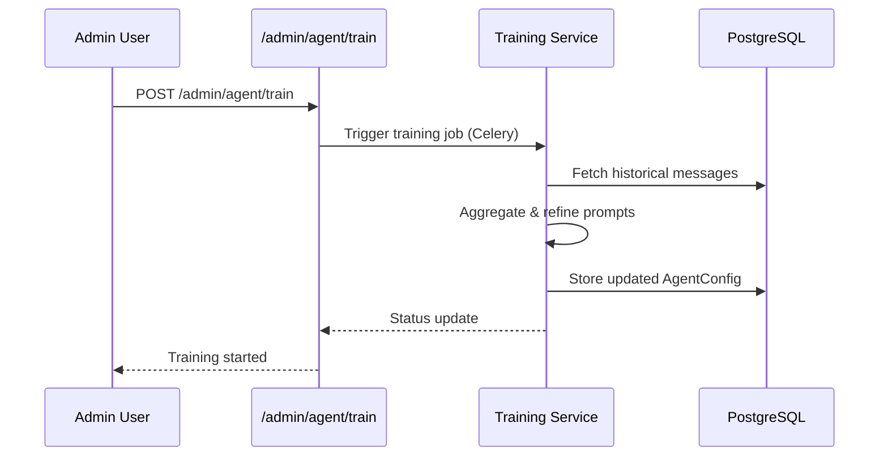
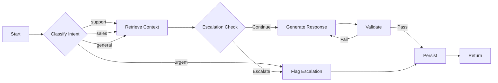
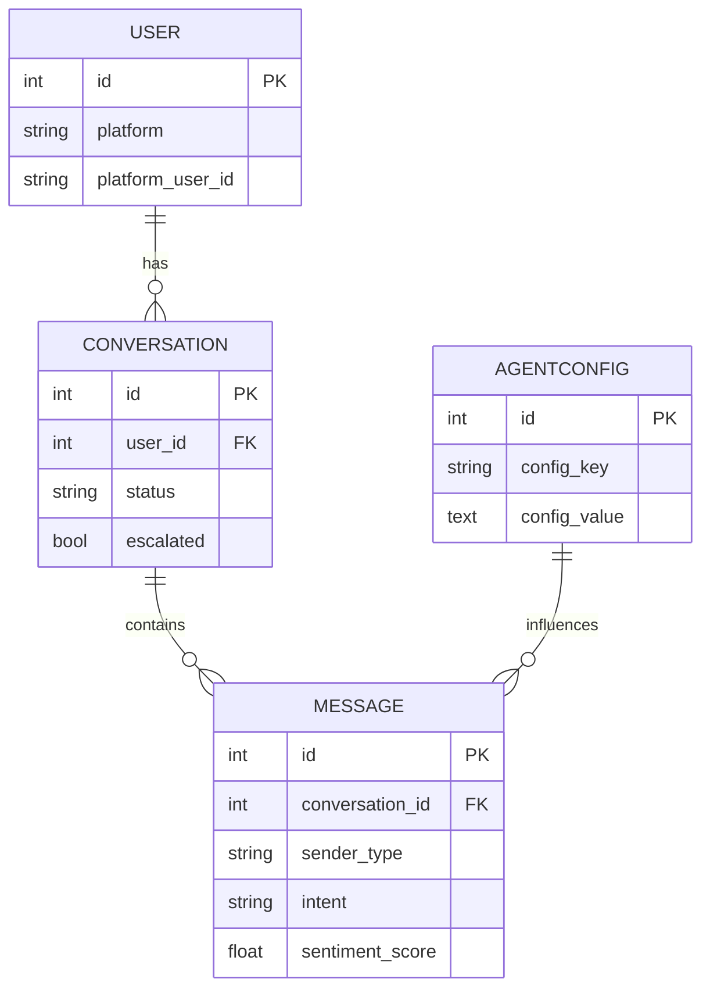
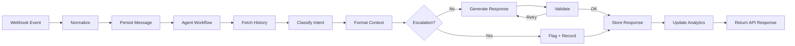

# Architecture Documentation

## System Overview

The AI-Powered Customer Support & Sales Agent is a comprehensive solution for automating customer interactions across multiple platforms (TikTok and LinkedIn) using advanced AI technologies.

## Technology Stack

### Core Framework
- **FastAPI**: Modern, fast web framework for building APIs
- **LangGraph**: State machine for orchestrating AI agent workflows
- **LangChain**: Framework for LLM integration
- **Pydantic**: Data validation using Python type annotations

### Data Layer
- **PostgreSQL**: Relational database for persistent storage
- **SQLAlchemy**: ORM for database interactions
- **Alembic**: Database migration tool

### Caching & Queuing
- **Redis**: In-memory data store for caching and message queuing
- **Celery**: Distributed task queue for async processing

### LLM Providers (Optional)
- **OpenAI GPT-3.5/4**: For natural language understanding and generation
- **Anthropic Claude**: Alternative LLM provider
- **Mock Provider**: Fallback for development without API keys

## Architecture Diagram

```
┌─────────────────────────────────────────────────────────────────┐
│                        External Platforms                        │
│                     (TikTok, LinkedIn)                           │
└────────────────────────┬────────────────────────────────────────┘
                         │ Webhooks
                         ▼
┌─────────────────────────────────────────────────────────────────┐
│                      FastAPI Application                         │
│  ┌────────────────────────────────────────────────────────────┐ │
│  │              Webhook Handlers Layer                        │ │
│  │  - TikTok Webhook Receiver                                 │ │
│  │  - LinkedIn Webhook Receiver                               │ │
│  └────────────────────────┬───────────────────────────────────┘ │
│                           │                                      │
│  ┌────────────────────────▼───────────────────────────────────┐ │
│  │           Message Processing Service                       │ │
│  │  - User/Conversation Management                            │ │
│  │  - Message Storage                                         │ │
│  │  - Response Orchestration                                  │ │
│  └────────────────────────┬───────────────────────────────────┘ │
│                           │                                      │
│  ┌────────────────────────▼───────────────────────────────────┐ │
│  │              LangGraph Agent Workflow                      │ │
│  │  ┌──────────────────────────────────────────────────────┐ │ │
│  │  │  1. Intent Classification                            │ │ │
│  │  │  2. Context Retrieval                                │ │ │
│  │  │  3. Escalation Check                                 │ │ │
│  │  │  4. Response Generation                              │ │ │
│  │  │  5. Response Validation                              │ │ │
│  │  └──────────────────────────────────────────────────────┘ │ │
│  └────────────────────────┬───────────────────────────────────┘ │
│                           │                                      │
│  ┌────────────────────────▼───────────────────────────────────┐ │
│  │            Platform Integration Clients                    │ │
│  │  - TikTok API Client (Mock)                                │ │
│  │  - LinkedIn API Client (Mock)                              │ │
│  └────────────────────────────────────────────────────────────┘ │
└─────────────────────────────────────────────────────────────────┘
         │                    │                    │
         ▼                    ▼                    ▼
┌──────────────┐    ┌──────────────┐    ┌──────────────┐
│  PostgreSQL  │    │    Redis     │    │     LLM      │
│   Database   │    │ Cache/Queue  │    │   │
└──────────────┘    └──────────────┘    └──────────────┘
```

## Data Flow

### Incoming Message Flow

1. **Webhook Reception**: Platform sends message via webhook
2. **User/Conversation Lookup**: Check if user/conversation exists, create if not
3. **Message Storage**: Save incoming message to database
4. **Agent Processing**: 
   - Load conversation history
   - Pass to LangGraph workflow
   - Execute agent nodes sequentially
5. **Response Generation**: LLM generates appropriate response based on intent
6. **Escalation Check**: Determine if human intervention is needed
7. **Response Storage**: Save agent response to database
8. **Platform Delivery**: Send response back to platform
9. **Analytics Update**: Record metrics (response time, sentiment, etc.)

### Agent Workflow (LangGraph)

```
START
  │
  ▼
[Classify Message]
  │
  ├─ Support
  ├─ Sales
  ├─ General
  └─ Urgent
  │
  ▼
[Retrieve Context]
  │
  ▼
[Check Escalation]
  │
  ├─ Urgent? ──────┐
  ├─ Negative? ────┤
  └─ Normal ───────┤
                   │
  ┌────────────────┘
  ▼
[Generate Response]
  │
  ▼
[Validate Response]
  │
  ▼
END
```

## Database Schema

### Entity Relationship Diagram

```
┌─────────────┐         ┌──────────────────┐         ┌─────────────┐
│    User     │         │  Conversation    │         │   Message   │
├─────────────┤         ├──────────────────┤         ├─────────────┤
│ id (PK)     │◄───────┐│ id (PK)          │◄───────┐│ id (PK)     │
│ platform    │        ││ user_id (FK)     │        ││ conv_id(FK) │
│ platform_id │        │├──────────────────┤        │├─────────────┤
│ username    │        ││ platform         │        ││ sender_type │
│ display_name│        ││ platform_conv_id │        ││ content     │
│ created_at  │        ││ status           │        ││ intent      │
└─────────────┘        ││ escalated        │        ││ sentiment   │
                       ││ escalation_reason│        ││ created_at  │
                       ││ created_at       │        │└─────────────┘
                       │└──────────────────┘        │
                       │                            │
                       └────────────────────────────┘

┌──────────────────┐         ┌─────────────┐
│  AgentConfig     │         │  Analytics  │
├──────────────────┤         ├─────────────┤
│ id (PK)          │         │ id (PK)     │
│ config_key       │         │ metric_type │
│ config_value     │         │ metric_value│
│ description      │         │ dimension   │
│ created_at       │         │ timestamp   │
│ updated_at       │         └─────────────┘
└──────────────────┘
```

### Key Tables

**Users**
- Stores platform-specific user information
- One user can have multiple conversations

**Conversations**
- Represents a conversation thread
- Tracks status (active, escalated, closed)
- Stores escalation metadata

**Messages**
- Individual messages in a conversation
- Stores intent, sentiment, and response time
- Links to conversation

**AgentConfig**
- Stores agent configuration (prompts, rules)
- Allows dynamic configuration updates

**Analytics**
- Time-series metrics for monitoring
- Supports aggregation by dimension

## API Design

### RESTful Principles

- **Resource-based URLs**: `/conversations`, `/messages`
- **HTTP Methods**: GET, POST, PUT, DELETE
- **Status Codes**: Proper use of 200, 201, 400, 404, 500
- **JSON Responses**: Consistent response format
- **Error Handling**: Structured error responses

### Endpoint Categories

1. **Webhooks** (`/webhooks/*`): Receive platform events
2. **Messages** (`/messages/*`): Manage conversations and messages
3. **Analytics** (`/analytics/*`): Retrieve metrics and insights
4. **Admin** (`/admin/*`): Administrative operations

## LangGraph Agent Design

### State Management

```python
class AgentState(TypedDict):
    message: str                    # Incoming message
    conversation_history: List      # Previous messages
    intent: str                     # Classified intent
    formatted_context: str          # Formatted history
    response: str                   # Generated response
    requires_escalation: bool       # Escalation flag
    escalation_reason: str          # Reason for escalation
    sentiment_score: float          # Sentiment (-1 to 1)
    response_valid: bool            # Validation result
```

### Node Functions

1. **classify_message**: Determines message intent using LLM or rules
2. **retrieve_context**: Formats conversation history
3. **check_escalation**: Identifies urgent issues
4. **generate_response**: Creates appropriate response
5. **validate_response**: Ensures response quality

### Conditional Logic

- **Escalation Detection**: Checks for urgency keywords, negative sentiment
- **Intent-based Routing**: Different prompts for support vs sales
- **Validation Gates**: Ensures responses meet quality standards

## Scalability Considerations

### Horizontal Scaling
- **Stateless API**: Can run multiple FastAPI instances
- **Database Connection Pooling**: Efficient connection management
- **Redis for Caching**: Reduces database load

### Performance Optimizations
- **Async Endpoints**: Non-blocking I/O for webhooks
- **Message Queue**: Celery for background processing
- **Database Indexing**: On frequently queried fields

### Monitoring
- **Logging**: Comprehensive logging with loguru
- **Metrics**: Response times, error rates, escalation rates
- **Health Checks**: `/health` endpoint for load balancers

## Security Considerations

### Authentication & Authorization
- API keys for webhook verification
- OAuth 2.0 for platform integrations
- Role-based access control (future enhancement)

### Data Protection
- Environment-based configuration
- Encrypted database connections
- Secrets management via environment variables

### Rate Limiting
- Platform-specific rate limits (TikTok: 60/min, LinkedIn: 100/min)
- Request throttling to prevent abuse

## Deployment Architecture

### Development
```
Docker Compose
├── PostgreSQL Container
├── Redis Container
├── FastAPI App Container
└── Celery Worker Container
```

### Production (Recommended)
```
Load Balancer (Nginx)
├── FastAPI Instance 1
├── FastAPI Instance 2
└── FastAPI Instance N
    ├── PostgreSQL (RDS/Managed)
    ├── Redis (ElastiCache/Managed)
    └── Celery Workers (Auto-scaling)
```

## Future Enhancements

1. **Multi-language Support**: Detect and respond in customer's language
2. **Sentiment Analysis**: Advanced emotion detection
3. **A/B Testing**: Test different prompts and measure performance
4. **Real-time Dashboard**: WebSocket-based live monitoring
5. **Knowledge Base Integration**: RAG for accurate product information
6. **Voice/Video Support**: Extend to voice and video calls

## Additional Diagrams & Visualizations

### Incoming Webhook Sequence


### Escalation Decision Flow


### Agent Training (Conceptual) Sequence


### LangGraph Workflow (Mermaid)


### Database Schema (Mermaid ER)


### High-Level Data Flow (Mermaid)



